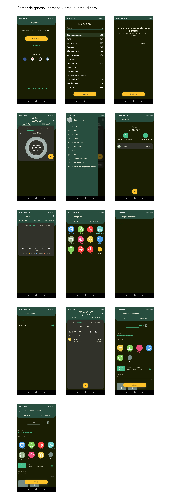
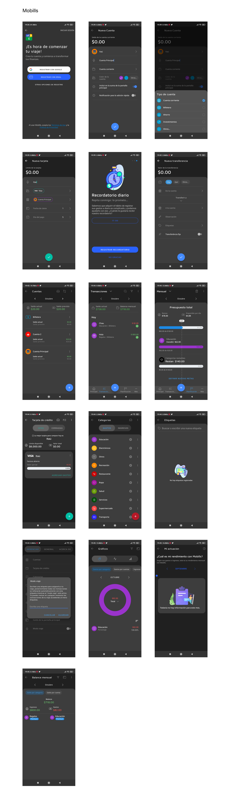

Analisis de la investigacion de la tecnica de análisis de interfaz de usuario:

Gestor de gastos

Características principales de la app:
- Inicio de Sesión
- Selección de divisa principal
- Creación de varias cuentas con funcionalidad multi moneda
- Gráficos de gastos e ingresos
- Categorías para gastos e ingresos
- Creación de pagos habituales
- Creación de recordatorios
- Vista de transacciones por día, semana, mes, año y periodo
- Creación de transacciones (Gastos e ingresos)

Mobills Finanzas Personales

Características principales de la app:
- Inicio de sesión
- Creación de cuenta (no multi moneda)
- Creación de tarjeta de crédito
- Creación de recordatorios
- Creación de metas y presupuestos
- Creacion de categorias
- Creación de etiquetas
- Creación de transferencias entre cuentas
- Creación de ajustes de cuentas
- Modo Viaje
- Gráficos de proyecciones, balance actual
- Informes de rendimientos según datos de la app

